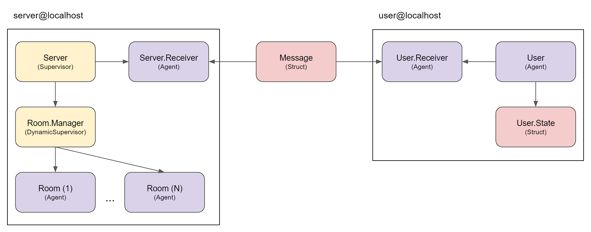

# Hermes

The idea behind the project is to be used as example in an presentation about *Actor Model*.

## Starting

### Create session using *mix*
```
iex --sname `node_name` -S mix
```

### Start server instance
```
Server.start
```

### Create user instance
```
User.start `username`, `server_address`, `room`
```

## Inner Workings

The main starting points are the `Server` and the `User`. Both have a method called `start` receiving the necessary parameters to properly start.



- Both User and Server receiver's are external implementations beacuse they stay stuck in a loop receiving the incomming messages.

- The server acts only as a [Supervisor](https://hexdocs.pm/elixir/Supervisor.html) of it's message receiver and the room manager.

- The room manager is external to the server because it implements a [DynamicSupervisor](https://hexdocs.pm/elixir/DynamicSupervisor.html), used to manage the rooms.

## Behind the name

I'm a great fan of the manga *JoJo's Bizarre Adventures*, and the name is a direct refference to the character [Hermes Costello](https://jojo.fandom.com/wiki/Ermes_Costello).

In short, she has the ability to duplicate and destroy objects. Thus the reference.


## TO-DO

- [ ] Add an user supervisor to emmit "exit" events